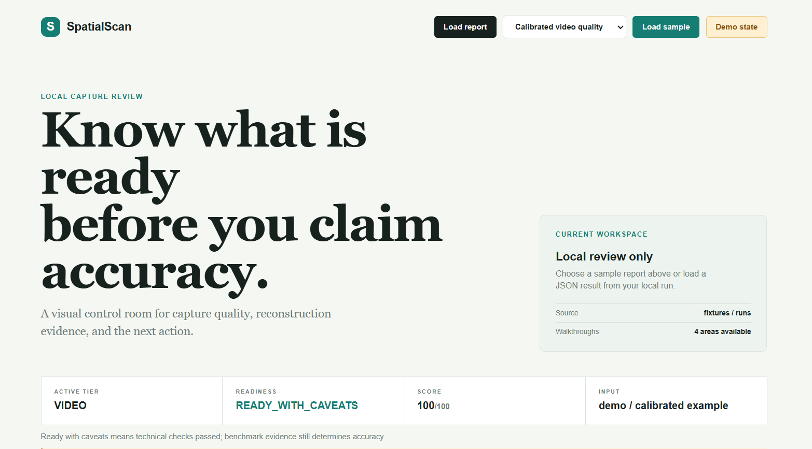
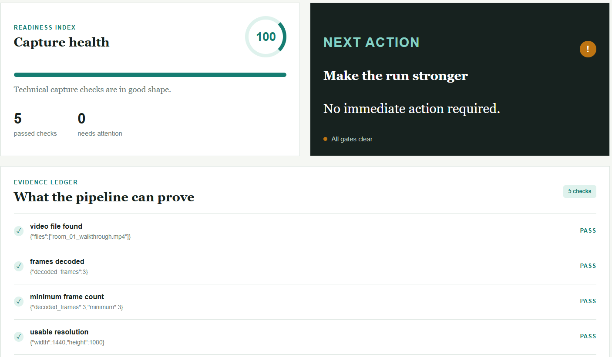
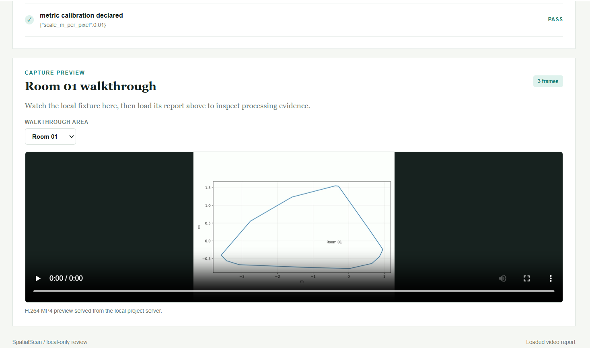
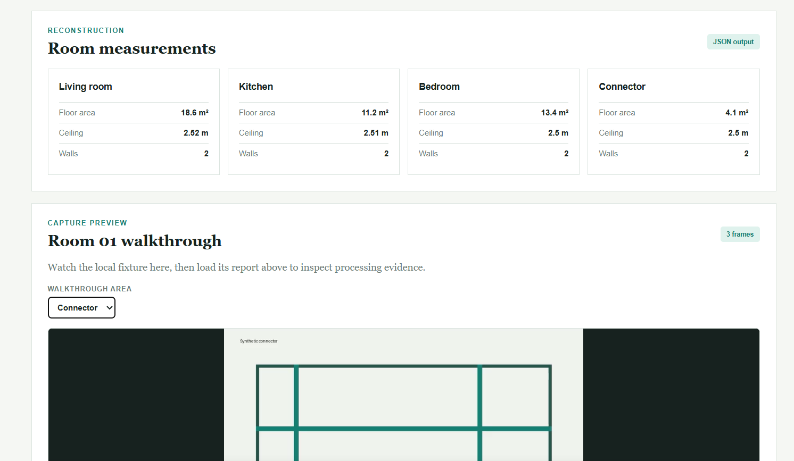

# SpatialScan — Applied AI Engineer Case Study

A local, reproducible three-tier indoor reconstruction pipeline for the August 2026 Applied AI Engineer case study.

## Tiers

1. Photos: 2–8 stills per room, no depth/poses.
2. Video: handheld walkthrough.
3. LiDAR: depth + poses + intrinsics.

The implementation deliberately separates **measurement**, **calibration**, and **reporting**. It never converts an unmeasured result into a passing claim.

## At a glance

| Need                   | Use                                 | Result                         |
| ---------------------- | ----------------------------------- | ------------------------------ |
| Process a capture      | `python -m spatialscan run ...`     | Reconstruction JSON            |
| Check readiness        | `python -m spatialscan quality ...` | Score, checks, recommendations |
| View results           | `python -m spatialscan report ...`  | Portable HTML report           |
| Use the dashboard      | `scripts/open_dashboard.ps1`        | Local visual review UI         |
| Watch the sample video | `scripts/open_video_preview.ps1`    | Browser video player           |

The project is local-only. It does not call a hosted backend, upload captures, or require model weights. The dashboard launcher starts a local-only Python HTTP server because browsers restrict video playback from `file://` pages.

## What is implemented

- One CLI command per capture.
- Common JSON output contract for all tiers.
- LiDAR depth/pose reconstruction with confidence filtering.
- Plane/floor/wall estimation and metric footprint extraction.
- Photo/video visual reconstruction path with OpenCV line detection and calibrated uncertainty.
- Multi-room graph representation and drift-correction hooks.
- Opening/damage/scope schemas.
- Ground-truth comparison and gate evaluation.
- Fixture ablation report generation and repeat-capture comparison infrastructure.
- Before/after fix-loop structure.
- Deterministic fixture replay.
- Windows/macOS/Linux setup.

## Quick start

Python 3.11+ is recommended.

```bash
python -m venv .venv

# Windows PowerShell
.venv\Scripts\Activate.ps1

# macOS/Linux
# source .venv/bin/activate

pip install -r requirements.txt

pip install -e .

python -m spatialscan --help
```

Run the included LiDAR fixture:

```bash
python -m spatialscan run --tier lidar --input fixtures/lidar_sample --output runs/lidar_fixture.json --render runs/lidar_fixture.png
```

Run the included video fixture from the VS Code PowerShell terminal:

```powershell
.\scripts\run_video_fixture.ps1
```

This uses the project `.venv` explicitly and writes `runs/video_fixture.json`.

To watch the video in a browser from VS Code, run:

```powershell
.\scripts\open_video_preview.ps1
```

VS Code may not preview MP4 files in its editor. The dashboard and preview page
serve the browser-compatible H.264 MP4 through the local server. VLC or Windows
Media Player can also open the original file. Use the processing command above
to analyze it.

The dashboard's **Walkthrough area** selector provides separate clips for:

- Room 01
- Room 02
- Room 03
- Connector

Choose a report from the sample picker, then select **Load sample**. Choose
**Demo state** for a clean calibrated example without loading a file.

Check capture readiness before reconstruction:

```bash
python -m spatialscan quality --tier video --input fixtures/video --output runs/quality_video.json
```

The quality report checks file discovery, decoding, frame/image coverage,
resolution, LiDAR metadata, confidence and pose coverage, then returns a score,
readiness status, and concrete recommendations. `REVIEW` is intentional when
visual metric calibration has not been declared.

Pass the same measured calibration to the quality check when it is available:

```bash
python -m spatialscan quality --tier video --input fixtures/video --output runs/quality_video_calibrated.json --scale-m-per-pixel 0.01
```

Run a visual tier with an explicit scale calibration when a measured reference
has been collected:

```bash
python -m spatialscan run --tier photos --input fixtures/photo --output runs/photos_calibrated.json --scale-m-per-pixel 0.01
```

Render any JSON quality or reconstruction result as a portable HTML report:

```bash
python -m spatialscan report --input runs/quality_video.json --output runs/quality_video.html
```

Evaluate against supplied ground truth:

```bash
python -m spatialscan evaluate --prediction runs/lidar_fixture.json --ground-truth benchmarks/ground_truth/example.json --output benchmarks/results/lidar_fixture.json
```

> The included fixture is a sensor-format smoke test, not claimed benchmark ground truth. Replace/add your measured benchmark set before submitting accuracy numbers.

## Capture route

This submission uses **Route 2 (stock capture protocol)** so the evaluator can reproduce it without installing a custom iOS build.

See [`docs/capture_protocol.md`](docs/capture_protocol.md).

Submission evidence is mapped in [`docs/rubric_evidence.md`](docs/rubric_evidence.md).
Constraint and dependency disclosures are in
[`docs/constraint_disclosure.md`](docs/constraint_disclosure.md), and the
required difficult-scene coverage is listed in
[`docs/adversarial_capture_matrix.md`](docs/adversarial_capture_matrix.md).

## Output

The common schema is documented in [`docs/output_schema.md`](docs/output_schema.md). Each run produces:

- `capture.json`: normalized capture metadata
- `plan.json`: per-room + stitched plan
- measurement confidence intervals
- openings, damage regions and concealed-damage flags
- scope line items
- machine-readable gate metrics
- optional rendered plan

## Accuracy policy

Benchmark reports use:

- `PASS`
- `FAIL`
- `NOT_RUN`
- `INSUFFICIENT_GROUND_TRUTH`

No result is marked PASS unless the corresponding ground truth and tolerance are present.

## Architecture

```text
capture
  │
  ├── photos ──────┐
  ├── video ───────┼──> tier adapter ─> geometric reconstruction
  └── lidar ───────┘                         │
                                            v
                                  room / surface graph
                                            │
                          ┌─────────────────┼─────────────────┐
                          v                 v                 v
                     measurements       damage/flags       scope
                          │                 │                 │
                          └─────────────────┼─────────────────┘
                                            v
                                     confidence model
                                            │
                                            v
                                  common JSON + renderer
                                            │
                                            v
                                    gate evaluator
```

## Important limitations

Metric reconstruction from arbitrary monocular photos/video is scale-ambiguous. The visual tiers therefore require a declared calibration source and widen intervals when calibration evidence is weak. They do **not** fabricate centimetre-level accuracy.

The supplied LiDAR fixture contains depth, confidence, camera intrinsics and odometry. It is included for pipeline validation only.

## Reproducing the benchmark

Raw benchmark captures and laser/tape measurements belong under `benchmarks/raw/` (large files are intentionally gitignored). Use:

```bash
python -m spatialscan benchmark --manifest benchmarks/manifest.json
```

The benchmark runner validates each manifest row, resolves capture paths from
the project root, runs available local captures, evaluates only when declared
ground truth exists, and records `NOT_RUN` for missing physical evidence. Its
measurement evaluator reports wall length, opening width, ceiling height,
whole-property floor area, and adjacency when the matching ground-truth values
are present. A partial measurement set cannot produce an overall PASS. It never
turns a fixture replay into an accuracy claim.

See [`benchmarks/README.md`](benchmarks/README.md) for the smoke/benchmark data
boundary, capture storage policy, and cold reproduction commands. The current
manifest is intentionally empty; it is not evidence that a physical benchmark
has been run. Repeatability remains `NOT_RUN` until paired captures are
collected; the runner reports deltas and only assigns PASS/FAIL when documented
tolerances are supplied. Incumbent comparisons still require original app
exports and review.

Audit the submission against the scoring rubric:

```bash
python -m spatialscan audit --output benchmarks/results/submission_audit.json
```

This report distinguishes implemented infrastructure from missing real evidence
and gives the next collection step for every blocked rubric component.

Record the shipped fix-loop delta on the unchanged LiDAR fixture:

```bash
python -m spatialscan fixloop --input fixtures/lidar_sample --output runs/fixloop_lidar.json
```

This produces a measured before/after ablation for the pose/IMU repair, but it
is explicitly not an accuracy result until laser/tape ground truth is added.
For an actual measured room, add `--ground-truth <measured.json>`; the report
will include before/after gate evaluations and numeric metric deltas. See
[`docs/fix_loop.md`](docs/fix_loop.md).

The benchmark runner also compares repeat-group pairs and records local
processing time. To run the cold reproduction profile and save its timing
record, use [`docs/walk_in_protocol.md`](docs/walk_in_protocol.md). A local
timing record is not a substitute for the physical unassisted walk-in study.
Incumbent head-to-head measurement comparison uses the normalized export
format in [`docs/incumbent_comparison_template.md`](docs/incumbent_comparison_template.md).

The manifest records every capture, device, tier, repeated-room pair, raw-data hash, ground-truth source and incumbent-app export.

Run the cold-capture workflow with:

```powershell
.\scripts\run_cold_capture.ps1 -Tier lidar -InputPath fixtures\lidar_sample -OutputDirectory runs\cold_lidar
```

Add `-GroundTruthPath <path>` to produce an evaluation artifact when measured
ground truth is available.

## Commit/process evidence

The project is designed to be developed incrementally. Keep capture collection, reconstruction, calibration, fix-loop and reporting changes in separate commits. Do not squash the complete history immediately before submission.

## Final project summary

This repository is a local three-tier indoor spatial reconstruction pipeline:

- `src/spatialscan/` contains the CLI, shared output models, photo/video processing, LiDAR loading and reconstruction, rendering, and evaluation logic.
- `fixtures/lidar_sample/` contains the deterministic LiDAR sensor-format fixture.
- `fixtures/photo/` contains synthetic PNG smoke images for Room 1, Room 2, Room 3, and the connector grouping path.
- `fixtures/video/` contains separate synthetic H.264 MP4 smoke videos for Room 1, Room 2, Room 3, and the connector.
- `configs/` contains reference YAML settings. The CLI does not load a config file yet.
- `models/` contains only `README.md`. No model weights are included or required by the current geometry/OpenCV implementation.
- `benchmarks/` contains three registered raw LiDAR ZIP archives, the manifest, example ground truth, and benchmark documentation. Archive replay outputs and timing are in `benchmarks/results/`; the ZIPs have SHA-256 digests in `benchmarks/raw/SHA256SUMS.txt`.
- `runs/` stores generated JSON and rendered outputs and is intentionally ignored by Git.
- `tests/` contains the automated checks for evaluation, LiDAR fixtures, geometry, photo input, and MP4 video input.
- `web/` contains a zero-install visual dashboard for quality and reconstruction JSON reports.

The project is validated with `15` passing tests. The photo and video tiers are smoke-tested only; their metric scale requires calibration. The supplied LiDAR fixture is a pipeline smoke test, not measured benchmark ground truth, so it must not be used as an accuracy claim.

## Visual dashboard

Open the dashboard from a PowerShell terminal:

```powershell
.\scripts\open_dashboard.ps1
```

The launcher opens `http://127.0.0.1:8765/web/index.html` and serves only the
local project directory. This is required for the embedded video to load.

Use **Load report** to open `runs/quality_video.json`, `runs/quality_lidar.json`,
or any reconstruction JSON. The dashboard runs entirely in the browser and
does not upload data. Tracked examples are available under `web/samples/`, and
the dashboard includes one-click quality, room, and benchmark samples.
The dashboard visibly labels these as sample data: they are runnable examples,
not laser/tape ground truth, repeat captures, or incumbent exports.





#

